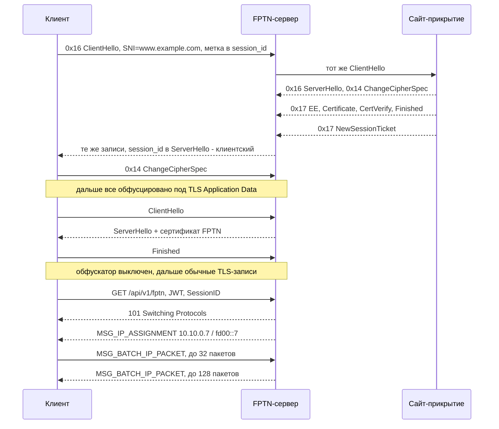

<div align="center">

<H1>FPTN</H1>
<H6>Custom VPN technology</H6>

[\[English\]](README.md)
•
[\[Русский\]](README_RU.md)


[](https://github.com/batchar2/fptn/releases)
[](https://github.com/batchar2/fptn/releases)
[](https://github.com/batchar2/fptn/releases)
[](https://github.com/batchar2/fptn/releases)
[](https://github.com/batchar2/fptn/actions/workflows/main.yml)
[](https://github.com/batchar2/fptn/releases)
</div>

---

### Основные возможности FPTN


FPTN — это VPN-технология, созданная с нуля для безопасного и устойчивого к блокировкам соединения, позволяющего обходить цензуру и сетевую фильтрацию.

Сайт проекта: [https://storage.googleapis.com/fptn.org/index.html](https://storage.googleapis.com/fptn.org/index.html)

Основные возможности включают:

1. **L3-туннель (IP-уровень)**
  - Передача IP-пакетов (IPv4 и IPv6) через VPN-туннель до сервера.
  - Поддержка **split-tunneling** — возможность направлять через VPN только определённый трафик, а остальной трафик идёт напрямую. Позволяет гибко настраивать политику маршрутизации на основе указания правил для доменов и сетей.
  - На серверной стороне реализован **NAT**. В дальнейшем планируется поддержка объединения пользователей в группы с созданием виртуальных локальных сетей для совместного взаимодействия.

2. **Маскировка трафика и обход блокировок**
  - **Устойчивость к активному DPI**: сервер способен идентифицировать клиентов по TLS-handshake, анализируя session_id (значение которого умеет устанавливать FPTN-клиент по специальному методу от времени). Если определяется, что клиент не является FPTN-клиентом, сервер возвращает легитимный контент запрашиваемого домена, выступая в роли прозрачного прокси.
  - VPN-соединение маскируется под обычный HTTPS-трафик (еще в разработке — режим короткоживущих HTTPS-соединений).
  - Реализованы три метода обхода блокировок:
    1. **Подмена SNI**: в инициирующем соединение TLS-пакете устанавливается поддельный домен. Системы анализа трафика видят легитимное соединение, а на самом деле трафик направляется на VPN-сервер.
    2. **Обфускация**: трафик выглядит как уже установленная TLS-сессия, скрывая TLS-handshake и предотвращая детектирование DPI.
    3. **Reality Mode + SNI**: клиент инициирует соединение с VPN-сервером с подменой SNI, получает реальный TLS-handshake от настоящего сайта, после чего в том же соединении продолжается обмен данными с VPN-сервером.
  - В десктопной версии клиента реализован `сканнер SNI`.

3. **Транспортный протокол**
  - Используется собственный транспортный протокол на основе **Protobuf** для передачи данных между клиентом и сервером.
  - **Padding на уровне протокола**: пакеты данных дополняются случайными данными для рандомизации трафика и затруднения анализа.
  - Сервер предоставляет **REST API** для авторизации клиентов и получения специальных настроек.

4. **Специальные возможности**
  - Встроенная фильтрация нежелательного трафика (например, протокол BitTorrent).
  - Контроль скорости и трафика каждого пользователя: сервер включает шейпер на основе алгоритма **Leaky Bucket**, что позволяет гибко настраивать политику скорости.
  - Поддержка многосерверной архитектуры с одним мастер-сервером, где хранится вся информация о пользователях.
  - Мониторинг работы системы через **Prometheus** и визуализация в **Grafana**.
  - Возможность подключения пользователей через **Telegram-бота**.

5. **Кроссплатформенные клиенты**
  - Разработана кроссплатформенная библиотека **`libfptn`**, которая может использоваться на различных операционных системах. Внутри реализованы сетевой протокол FPTN, управление соединением и механизмы передачи данных через VPN-туннель.
  - **Десктоп:** Windows, macOS, Linux — минималистичный клиент с акцентом на простоту использования.
  - **Мобильные устройства:** Android, iOS (в разработке).

6. **Простая настройка через токен**
  - **Токен** — это специально сгенерированный конфигурационный файл, который содержит все необходимые настройки системы.
  - Позволяет подключаться к VPN без ручной конфигурации и лишних действий: достаточно добавить токен в клиент, чтобы начать работу.

---

### Как это работает

Ниже — устройство протокола: путь пакета, слои соединения, три режима обхода блокировок, схема Reality и работа скользящих туннелей. Рядом с каждым блоком указан файл с реализацией.

#### Путь пакета

```text
        приложения на устройстве
                   │  IP-пакеты (IPv4/IPv6)
                   ▼
        ┌─────────────────────┐
        │  TUN-интерфейс      │
        └──────────┬──────────┘
                   ▼
        ┌─────────────────────┐
        │ libfptn             │
        │  split-tunnel       │
        │  ad-block           │
        │  ConnectionManager  │
        └──────────┬──────────┘
                   │  TCP :443 — для наблюдателя обычный HTTPS
                   ▼
        ┌─────────────────────┐
        │ fptn-server         │
        │  распознавание      │
        │  фильтры            │
        │  NAT + Leaky Bucket │
        └──────────┬──────────┘
                   ▼
              в интернет
```

Клиент поднимает TUN-интерфейс, забирает с него IP-пакеты и решает, какие из них идут в туннель. Сервер распаковывает пакеты, прогоняет их через фильтры (BitTorrent, блеклист доменов) и шейпер, подменяет адреса через NAT и выпускает в интернет. Обратный трафик идет тем же путем в обратную сторону.

Код: [src/fptn-client/vpn/vpn_manager.cpp](src/fptn-client/vpn/vpn_manager.cpp), [src/fptn-server/web/session/session.cpp](src/fptn-server/web/session/session.cpp)

#### Слои соединения

```text
   IP-пакеты из TUN
        │
        ├─ yaff: батч пакетов (до 32 от клиента, до 128 от сервера),
        │        мелкие батчи дополняются 64..128 случайными байтами
        ├─ WebSocket: бинарные кадры, /api/v1/fptn, JWT в заголовке
        ├─ TLS 1.2/1.3: клиент сверяет MD5-отпечаток сертификата из токена
        ├─ обфускатор: включен только на время handshake, дальше отключается
        └─ TCP :443
```

Паддинг добавляется только в батчи из одного-двух пакетов: в большом батче наружу видна лишь сумма размеров, и скрывать там уже нечего. Обфускатор снимается сразу после TLS-handshake — дальше по соединению идут настоящие TLS-записи, которые и так неотличимы от обычного HTTPS.

Код: [websocket_client.cpp](src/fptn-protocol-lib/https/websocket_client/websocket_client.cpp), [yaff_serializer.cpp](src/fptn-protocol-lib/protocol/yaff/yaff_serializer.cpp)

#### Как сервер отличает своих от чужих

FPTN-сервер слушает обычный 443 порт и не имеет права ничем себя выдать: кто угодно может прийти на него и проверить, что там отвечает. Поэтому клиент помечает себя в самом первом пакете — в поле `session_id` внутри TLS ClientHello:

```text
  session_id, 32 байта:

     [ случайные байты ][ КЛЮЧ ][ случайные байты ]
                           │
                           └─ первые 4 байта SHA1(текущее unix-время)
```

Никакого общего секрета не нужно: сервер считает такой же ключ сам и сравнивает, перебирая окно ±120 секунд. Метка живет пару минут, а место, где она лежит внутри `session_id`, заодно говорит серверу, какой режим выбрал клиент — обычное подключение или Reality.

Дальше решение принимается так:

```text
   новое TCP-соединение
        │
        ▼
   похоже на обфускатор?  ──да──►  снимаем маскировку, дальше TLS-handshake
        │ нет
        ▼
   это TLS ClientHello?  ──нет──►  закрыть соединение
        │ да
        ▼
   SNI в списке разрешенных?  ──нет──►  подставляем домен по умолчанию
        │ да
        ▼
   в session_id есть метка?  ──нет──►  ПРОЗРАЧНЫЙ ПРОКСИ на запрошенный домен:
        │ да                            активный сканер видит настоящий сайт
        ▼
   метка на месте Reality?  ──да──►  Reality-режим (см. ниже)
        │ нет
        ▼
   обычный клиент FPTN  ──►  TLS-handshake с сертификатом сервера
```

Это и есть защита от активного пробинга: если кто-то придет на 443 порт «просто посмотреть», сервер молча проксирует его на реальный сайт и отдает подлинный контент. Список разрешенных SNI на сервере необязателен — если он пуст, подходит любой домен. Дополнительно проверяется, не указывает ли SNI на сам сервер: иначе прокси зациклился бы сам на себя (вердикт кешируется на час).

Код: [session.cpp](src/fptn-server/web/session/session.cpp)

#### Три режима обхода блокировок

| Режим | Что видит наблюдатель в сети | Как включить |
|---|---|---|
| Подмена SNI | ClientHello с чужим доменом, дальше обычный TLS | в GUI: `SNI` |
| Обфускация | Handshake не виден вообще: с первого байта идет поток «TLS Application Data» | `--bypass-method obfuscation` |
| Reality + подмена SNI | ClientHello и настоящий ответ настоящего сайта, дальше продолжение той же сессии | `--bypass-method sni-spoofing-chrome-149` и т. п. |

По умолчанию клиент использует Reality с отпечатком Yandex Browser 26.4. Доступны отпечатки Chrome 145–149, Firefox 149–151, Yandex 24–26.4, Safari 26.4–26.5 — ClientHello собирается так, чтобы совпадать с настоящим браузером (набор шифров, расширения, GREASE, ALPN, группы кривых). Подходящий домен для подмены помогает найти встроенный в десктопный клиент сканер SNI.

#### Сетевая схема обмена (Reality)

Весь обмен идет в одном соединении. Участников трое: клиент, FPTN-сервер и сайт-прикрытие, чьим именем клиент представляется.

Ниже одна и та же схема в десяти видах — нужно оставить один вариант, остальные удалить.

**Вариант 1 — полная лесенка с сайтом**

```text
   КЛИЕНТ                              FPTN-СЕРВЕР                   САЙТ-ПРИКРЫТИЕ
  │                                         │                               │
  ╞════════════ 1. ПРИМАНКА: клиент представляется чужим именем ════════════╡
  │                                         │                               │
  │ 0x16 ClientHello                        │                               │
  │   SNI        = www.example.com          │                               │
  │   session_id = 32 Б, внутри метка       │                               │
  │                SHA1(текущее время)      │                               │
  │   отпечаток  = Chrome 149               │                               │
  ├────────────────────────────────────────►│                               │
  │                                         │                               │
  │                                         │ тот же ClientHello            │
  │                                         ├──────────────────────────────►│
  │                                         │              0x16 ServerHello │
  │                                         │         0x14 ChangeCipherSpec │
  │                                         │     0x17 EncryptedExtensions, │
  │                                         │      Certificate, CertVerify, │
  │                                         │    Finished — все зашифровано │
  │                                         │ 0x17 NewSessionTicket — хвост │
  │                                         │◄──────────────────────────────┤
  │                                         │                               ×
  │                                         │
  │   0x16 ServerHello + session_id клиента │
  │                   0x14 ChangeCipherSpec │
  │  0x17 EncryptedExtensions, Certificate, │
  │                    CertVerify, Finished │
  │                   0x17 NewSessionTicket │
  │◄────────────────────────────────────────┤
  │ ChangeCipherSpec                        │
  ├────────────────────────────────────────►│
  │ хвост дочитывать не обязательно:        │
  │ обфускатор сам найдет свое начало       │
  │                                         │
  ╞═══ 2. НАСТОЯЩИЙ TLS С FPTN-СЕРВЕРОМ ════╡
  │                                         │
  │ все обфусцировано: каждая порция        │
  │ байт идет как TLS Application Data      │
  │                                         │
  │ ClientHello                             │
  ├────────────────────────────────────────►│
  │           ServerHello + сертификат FPTN │
  │◄────────────────────────────────────────┤
  │ Finished                                │
  ├────────────────────────────────────────►│
  │                                         │
  ╞═════ 3. WEBSOCKET: вход в туннель ══════╡
  │                                         │
  │ GET /api/v1/fptn                        │
  │   Authorization: Bearer <JWT>           │
  │   X-Serializer:  yaff                   │
  │   SessionID:     <общий для пула>       │
  ├────────────────────────────────────────►│
  │                 101 Switching Protocols │
  │◄────────────────────────────────────────┤
  │  MSG_IP_ASSIGNMENT: 10.10.0.7 / fd00::7 │
  │◄────────────────────────────────────────┤
  │                                         │
  ╞══════════════ 4. ТУННЕЛЬ ═══════════════╡
  │                                         │
  │ MSG_BATCH_IP_PACKET: до 32 IP-пакетов   │
  ├════════════════════════════════════════►│
  │  MSG_BATCH_IP_PACKET: до 128 IP-пакетов │
  │◄════════════════════════════════════════┤
  │                                         │
```

**Вариант 2 — компактная лесенка, сайт спрятан**

```text
   КЛИЕНТ                                                FPTN-СЕРВЕР
  │                                                           │
  │ 0x16 ClientHello (чужой SNI, метка в session_id)          │
  ├──────────────────────────────────────────────────────────►│
  │                [сервер сходил на сайт и вернул его ответ] │
  │     0x16 ServerHello · 0x14 CCS · 0x17 Cert · 0x17 Ticket │
  │◄──────────────────────────────────────────────────────────┤
  │ 0x14 ChangeCipherSpec                                     │
  ├──────────────────────────────────────────────────────────►│
  │                                                           │
  │ настоящий TLS — под видом TLS Application Data            │
  │◄─────────────────────────────────────────────────────────►│
  │                                                           │
  │ GET /api/v1/fptn + JWT                                    │
  ├──────────────────────────────────────────────────────────►│
  │                   101 Switching Protocols + выдача VPN-IP │
  │◄──────────────────────────────────────────────────────────┤
  │                                                           │
  │ MSG_BATCH_IP_PACKET                                       │
  ├══════════════════════════════════════════════════════════►│
  │                                       MSG_BATCH_IP_PACKET │
  │◄══════════════════════════════════════════════════════════┤
  │                                                           │
```

**Вариант 3 — нумерованные шаги без лесенки**

```text
    1  клиент → сервер  0x16 ClientHello       SNI=www.example.com, метка в session_id
    2  сервер → сайт    0x16 ClientHello       тот самый пакет, что прислал клиент
    3  сайт   → сервер  0x16 ServerHello       открытая запись, в ней session_id сайта
                        0x14 ChangeCipherSpec  один байт 0x01
                        0x17 <зашифровано>     EE, Certificate, CertVerify, Finished
                        0x17 NewSessionTicket  хвост, который сайт шлет следом
    4  сервер → клиент  те же записи           session_id в ServerHello ← клиентский
    5  клиент → сервер  0x14 ChangeCipherSpec  приманка закончена

    6  клиент → сервер  0x17 обфускация        настоящий ClientHello
    7  сервер → клиент  0x17 обфускация        ServerHello + сертификат FPTN
    8  клиент → сервер  0x17 обфускация        Finished; обфускатор выключается

    9  клиент → сервер  HTTP Upgrade           GET /api/v1/fptn, JWT, SessionID
   10  сервер → клиент  101 Switching          далее MSG_IP_ASSIGNMENT с VPN-IP
   11  клиент ⇄ сервер  MSG_BATCH_IP_PACKET    IP-пакеты пачками, 32 и 128
```

**Вариант 4 — лесенка с выносом про сайт**

```text
   КЛИЕНТ                                  FPTN-СЕРВЕР
  │                                             │
  │ 0x16 ClientHello                            │
  │   SNI = www.example.com, метка в session_id │
  ├────────────────────────────────────────────►│
  │                                             │ ①
  │                                             │
  │       0x16 ServerHello + session_id клиента │
  │                       0x14 ChangeCipherSpec │
  │  0x17 EE, Certificate, CertVerify, Finished │
  │                       0x17 NewSessionTicket │
  │◄────────────────────────────────────────────┤
  │ 0x14 ChangeCipherSpec                       │
  ├────────────────────────────────────────────►│
  │                                             │
  │ настоящий TLS под видом Application Data    │
  │◄───────────────────────────────────────────►│
  │                                             │
  │ GET /api/v1/fptn + JWT + SessionID          │
  ├────────────────────────────────────────────►│
  │                     101 Switching Protocols │
  │◄────────────────────────────────────────────┤
  │      MSG_IP_ASSIGNMENT: 10.10.0.7 / fd00::7 │
  │◄────────────────────────────────────────────┤
  │                                             │
  │ MSG_BATCH_IP_PACKET                         │
  │◄═══════════════════════════════════════════►│
  │                                             │

  ① пока клиент ждет, сервер сходил на www.example.com:443:
       → 0x16 ClientHello — тот же самый, что прислал клиент
       ← 0x16 ServerHello · 0x14 ChangeCipherSpec
       ← 0x17 EncryptedExtensions, Certificate, CertVerify, Finished
       ← 0x17 NewSessionTicket
```

**Вариант 5 — таблица обмена**

```text
  ┌────┬──────────────────┬──────────────────────────┬────────────────────────────────────┐
  │ #  │ кто → кому       │ запись                   │ что внутри                         │
  ├────┼──────────────────┼──────────────────────────┼────────────────────────────────────┤
  │ 1  │ клиент → сервер  │ 0x16 ClientHello         │ SNI чужой, метка в session_id      │
  │ 2  │ сервер → сайт    │ 0x16 ClientHello         │ тот самый, что прислал клиент      │
  │ 3  │ сайт → сервер    │ 0x16 ServerHello         │ открытая, session_id сервера       │
  │    │                  │ 0x14 ChangeCipherSpec    │ один байт 0x01                     │
  │    │                  │ 0x17 ...                 │ EE, Certificate, CertVerify,       │
  │    │                  │                          │ Finished — зашифрованы             │
  │    │                  │ 0x17 NewSessionTicket    │ хвост, приходит следом             │
  │ 4  │ сервер → клиент  │ все записи шага 3        │ session_id ← клиентский            │
  │ 5  │ клиент → сервер  │ 0x14 ChangeCipherSpec    │ приманка закончена                 │
  ├────┼──────────────────┼──────────────────────────┼────────────────────────────────────┤
  │ 6  │ клиент → сервер  │ 0x17 (обфускация)        │ настоящий ClientHello              │
  │ 7  │ сервер → клиент  │ 0x17 (обфускация)        │ ServerHello + сертификат FPTN      │
  │ 8  │ клиент → сервер  │ 0x17 (обфускация)        │ Finished, обфускатор выключен      │
  ├────┼──────────────────┼──────────────────────────┼────────────────────────────────────┤
  │ 9  │ клиент → сервер  │ HTTP Upgrade             │ GET /api/v1/fptn, JWT, SessionID   │
  │ 10 │ сервер → клиент  │ 101 + MSG_IP_ASSIGNMENT  │ выдача VPN-IPv4 и IPv6             │
  │ 11 │ оба конца        │ MSG_BATCH_IP_PACKET      │ IP-пакеты: 32 от клиента, 128      │
  │    │                  │                          │ от сервера, + паддинг              │
  └────┴──────────────────┴──────────────────────────┴────────────────────────────────────┘
```

**Вариант 6 — развилка на сервере**

```text
                       приходит 0x16 ClientHello
                                   │
                      есть ли метка в session_id?
                     ┌─────────────┴─────────────┐
                     да                          нет
                     │                           │
                     режим Reality               прозрачный прокси
                     │                           │
                     шлет этот же ClientHello    соединяет TCP с
                     на www.example.com:443 и    www.example.com:443 и
                     отдает клиенту ответ сайта  переливает байты
                     │                           │
                     дальше настоящий TLS под    гость получает настоящий
                     видом Application Data,     сайт и уходит, про FPTN
                     WebSocket и туннель         не узнав ничего
```

**Вариант 7 — что во что завернуто по фазам**

```text
   фаза 1   ┌─ TCP ──────────────────────────────────────────────┐
            │  TLS-записи приманки: 0x16 / 0x14 / 0x17 от сайта  │
            └────────────────────────────────────────────────────┘

   фаза 2   ┌─ TCP ──────────────────────────────────────────────┐
            │  ┌─ 0x17: random, время, XOR-ключ, паддинг ─────┐  │
            │  │  настоящий TLS handshake, сертификат FPTN    │  │
            │  └──────────────────────────────────────────────┘  │
            └────────────────────────────────────────────────────┘

   фазы 3-4 ┌─ TCP ──────────────────────────────────────────────┐
            │  ┌─ настоящий TLS ─────────────────────────────┐   │
            │  │  ┌─ WebSocket ─────────────────────────┐    │   │
            │  │  │  yaff Message: IP-пакеты + паддинг  │    │   │
            │  │  └─────────────────────────────────────┘    │   │
            │  └─────────────────────────────────────────────┘   │
            └────────────────────────────────────────────────────┘
```

**Вариант 8 — таймлайн**

```text
   время ─────────────────────────────────────────────────────────────────►

   ├──── приманка ────┼── TLS под обфускацией ──┼─ WebSocket ─┼── туннель ──
   │                  │                         │             │
   │ ClientHello      │ ClientHello             │ GET         │ MSG_BATCH_
   │ ответ сайта      │ ServerHello + серт FPTN │ 101         │ IP_PACKET
   │ ChangeCipherSpec │ Finished                │ выдача IP   │ в обе стороны
```

**Вариант 9 — mermaid (рендерится на GitHub)**



**Вариант 10 — листинг записей на проводе**

```text
   → клиент → сервер     ← сервер → клиент     ⇢ сервер → сайт     ⇠ сайт → сервер

    → 0x16  ClientHello        sni=www.example.com  sid=<метка времени>
    ⇢ 0x16  ClientHello        тот же пакет, сервер → сайт
    ⇠ 0x16  ServerHello        sid=<значение сайта>
    ⇠ 0x14  ChangeCipherSpec   0x01
    ⇠ 0x17  <зашифровано>      EE, Certificate, CertVerify, Finished
    ⇠ 0x17  NewSessionTicket   хвост
    ← 0x16  ServerHello        sid=<эхо клиента>
    ← 0x14  ChangeCipherSpec   0x01
    ← 0x17  <зашифровано>      все, что прислал сайт
    ← 0x17  NewSessionTicket   хвост
    → 0x14  ChangeCipherSpec   конец приманки

    → 0x17  FPTN-запись        настоящий ClientHello
    ← 0x17  FPTN-запись        ServerHello + сертификат FPTN
    → 0x17  FPTN-запись        Finished

    → 0x17  TLS                GET /api/v1/fptn, JWT, SessionID
    ← 0x17  TLS                101 Switching Protocols
    ← 0x17  TLS                MSG_IP_ASSIGNMENT 10.10.0.7 / fd00::7
    → 0x17  TLS                MSG_BATCH_IP_PACKET (до 32 пакетов)
    ← 0x17  TLS                MSG_BATCH_IP_PACKET (до 128 пакетов)
```

Ключевое — фаза 1. Клиентский ClientHello уходит открытым текстом, и это ровно то, что должен увидеть цензор: обычный заход на `www.example.com`. Сервер ничего не подделывает — он пересылает **тот же самый** ClientHello настоящему сайту и возвращает клиенту его ответ как есть. Если метки в `session_id` нет, сервер просто проксирует гостя на сайт и никакого FPTN дальше не будет.

После `ChangeCipherSpec` наблюдатель считает, что сессия с сайтом установлена и дальше идут зашифрованные данные. На самом деле там начинается настоящий TLS с сертификатом FPTN-сервера — завернутый обфускатором в записи, неотличимые от application data этой же сессии. Как только handshake закончен, обфускатор выключается: дальше обычные TLS-записи, внутри которых WebSocket и туннель.

**Хвост от сайта и пересинхронизация**

Разберем, что именно приходит от сайта. Для TLS 1.3 это записи: `0x16` с `ServerHello` (открытая, в ней и лежит `legacy_session_id`), `0x14` с `ChangeCipherSpec` (один байт `0x01`, режим совместимости) и одна или несколько записей `0x17`, внутри которых зашифрованы `EncryptedExtensions`, `Certificate`, `CertificateVerify` и `Finished`. Следом сайт обычно досылает еще `0x17` с `NewSessionTicket` — это и есть хвост. Если сайт сработает по TLS 1.2, набор другой (`ServerHello`, `Certificate`, `ServerKeyExchange`, `ServerHelloDone` — все в записях `0x16`), но для FPTN разницы нет.

Разницы нет потому, что сервер FPTN эти записи **не разбирает и не может разобрать**: ClientHello был клиентский, значит ключи handshake тоже клиентские, и все, что после `ServerHello`, для сервера — непрозрачные байты. Поэтому граница ответа определяется не парсингом, а структурно: сервер читает, пока сайт не замолчит на 300 мс (или пока не наберется 64 КБ), и принимает результат, только если в буфере лежит целое число TLS-записей. Все, что пришло от сайта, уходит клиенту в том же виде — с той же последовательностью записей, теми же длинами и тем же содержимым. Меняется единственное поле: `legacy_session_id` в `ServerHello` переставляется на клиентский, потому что настоящий TLS-сервер всегда возвращает клиентское значение, а чужое выдало бы подмену сравнением двух открытых полей. На этом сайт свою роль отыграл: соединение с ним закрыто, дальше в сокете живет только FPTN.

Клиенту этот хвост не нужен: ему хватило ServerHello, чтобы отчитаться перед DPI. Поэтому к моменту включения обфускатора в сокете может лежать недочитанный остаток ответа сайта:

```text
   что лежит в сокете, когда включается обфускатор

   ┌─────────────────────────┬─────────────────────────────────────┐
   │ хвост ответа сайта      │ первая запись FPTN                  │
   │ (NewSessionTicket и др.)│ 0x17 03 03 | random | время | XOR   │
   └─────────────────────────┴─────────────────────────────────────┘
     │                         │
     │ отбрасывается           └─ отсюда поток синхронизирован
     └─ обфускатор идет побайтно, пока заголовок не сойдется
```

Обфускатор этот остаток не разбирает — он ищет свое. Идет по потоку побайтно, пока не сойдется заголовок FPTN: версия `03 03`, метка времени в окне ±120 секунд и согласованные между собой длины полезной части и паддинга. Все, что было до этого места, отбрасывается. Так один и тот же сокет без разрыва переходит от разговора с сайтом к разговору с FPTN-сервером — и именно поэтому обе стороны могут не считать байты ответа сайта.

**Как устроена обфусцированная запись**

```text
   ┌──────┬──────┬──────┬────────────────────────────────────────┐
   │ 0x17 │ 0x03 │ 0x03 │ длина записи                           │
   └──────┴──────┴──────┴────────────────────────────────────────┘
   ┌──────────┬───────────┬─────────┬────────────┬───────────────┐
   │ random 8 │ время 4   │ XOR 1   │ len 2      │ pad len 2     │
   └──────────┴───────────┴─────────┴────────────┴───────────────┘
   ┌────────────────────────────────┬────────────────────────────┐
   │ payload ^ XOR-ключ             │ 4..8 КБ случайного мусора  │
   └────────────────────────────────┴────────────────────────────┘
```

Одна запись в сокет — одна такая запись на проводе. Первые пять байт повторяют заголовок TLS Application Data, дальше идут поля FPTN: 8 случайных байт, метка времени (принимается окно ±120 секунд), однобайтовый XOR-ключ, длина полезной части и длина мусора. По этим полям сервер и узнает обфусцированный поток — отдельной настройки для этого не нужно. Ксор — это маскировка, а не шифрование: настоящее шифрование дает TLS уровнем выше, а случайный хвост ломает статистику размеров пакетов.

**4. Что летит в данных**

```text
   WebSocket binary frame
     └─ Message (yaff)
         ├─ protocol_version
         ├─ msg_type = MSG_BATCH_IP_PACKET
         └─ batch.packets[]
              ├─ Message ─ msg_type     = MSG_IP_PACKET
              │            payload      = сырой IP-пакет из TUN
              │            padding_data = 64..128 случайных байт
              ├─ Message ─ ...
              └─ Message ─ ...
```

Внутри WebSocket-кадра лежит одно сообщение с батчем: клиент склеивает до 32 IP-пакетов, сервер — до 128. Перед отправкой клиент подставляет в пакет выданный ему VPN-адрес как источник, а во входящих пакетах меняет получателя на адрес своего TUN — поэтому сервер может считать контрольные суммы один раз и не пересчитывать их на каждый пакет. Паддинг кладется только в батчи из одного-двух пакетов: в большом батче наружу видна лишь сумма размеров.

**Итого**

```text
   что видит цензор                    что происходит на самом деле
   ─────────────────────────────────   ─────────────────────────────────
   заход на www.example.com            соединение с FPTN-сервером
   настоящий сертификат этого сайта    сертификат взят у самого сайта
   обычный шифрованный трафик          VPN-туннель
   проверка «а что там на 443?»        сервер отдает настоящий сайт
```

Код: [websocket_client.cpp](src/fptn-protocol-lib/https/websocket_client/websocket_client.cpp) (клиент), [session.cpp](src/fptn-server/web/session/session.cpp) и [handshake_cache_manager.cpp](src/fptn-server/web/handshake/handshake_cache_manager.cpp) (сервер)

#### Режим «Обфускация» — без приманки

Тот же обфускатор можно включить с самого первого байта, без Reality. Тогда открытого ClientHello в соединении нет вообще:

```text
   КЛИЕНТ                                              FPTN-СЕРВЕР
  │                                                         │
  │ TCP SYN / SYN-ACK / ACK                                 │
  │◄═══════════════════════════════════════════════════════►│
  │ 0x17 0x03 0x03 | ... | ClientHello ^ XOR | мусор        │
  ├────────────────────────────────────────────────────────►│
  │                                                         │ поток опознан
  │              0x17 ... | ServerHello + сертификат ^ XOR  │ по служебным
  │◄────────────────────────────────────────────────────────┤ полям записи
```

Наблюдатель не видит ни начала сессии, ни SNI, ни сертификата: с первого пакета идет поток «application data», как будто TLS-сессию установили когда-то раньше. Цена — само отсутствие handshake тоже выглядит необычно, поэтому режим полезен там, где режут именно по SNI и по отпечатку ClientHello.

Код: [tls_obfuscator2.cpp](src/fptn-protocol-lib/https/obfuscator/methods/tls2/tls_obfuscator2.cpp), [tcp_stream.h](src/fptn-protocol-lib/https/obfuscator/tcp_stream/tcp_stream.h)

#### Скользящие туннели

Долгоживущее TLS-соединение на несколько часов — само по себе аномалия. Поэтому клиент не держит один сокет, а постоянно обновляет их: соединение живет 600 секунд, замена поднимается за 60 секунд до конца, и как только она готова, старый сокет закрывается.

```text
  rolling-tunnel — один канал

  t, с   0                        540 600                       1140
         ●━━━━━━━━ сокет #1 ━━━━━━━━┿━━✕
                                    └─► ●━━━━━━ сокет #2 ━━━━━━━━━┿━━►
                                        ▲
                                        замена готова — старый закрывается
```

При двух и трех каналах дедлайны специально разносятся во времени (600 / число каналов), чтобы сокеты не закрывались пачкой:

```text
  triple-rolling-tunnel — три канала, шаг 200 с

  t, с   0      200    400    600    800    1000   1200
  #1     ●━━━━━━✕
  #2     ●━━━━━━━━━━━━━✕
  #3     ●━━━━━━━━━━━━━━━━━━━━✕
  #4            ●━━━━━━━━━━━━━━━━━━━━✕
  #5                   ●━━━━━━━━━━━━━━━━━━━━✕
  #6                          ●━━━━━━━━━━━━━━━━━━━━✕
```

Все сокеты пула отправляют один и тот же `SessionID`, поэтому сервер склеивает их в одного логического клиента с одним VPN-IP: пакеты можно принимать и отправлять через любой из них. Конкретный поток (TCP или UDP) закрепляется за одним сокетом по номеру порта, чтобы не ломать порядок пакетов внутри соединения. На уровне протокола есть и заголовки `X-Send-Duration` и `X-Ttl` — ими соединение сообщает серверу, сколько оно будет отправлять данные и когда его закрывать.

Код: [rolling_tunnel.h](src/fptn-protocol-lib/connection/strategies/rolling_tunnel/rolling_tunnel.h), [connection_multiplexer.cpp](src/fptn-server/nat/connection_multiplexer/connection_multiplexer.cpp)

#### Токен и REST API

```text
  токен (base64 или brotli)
        │
        ├─ список серверов: host, port, MD5-отпечаток сертификата
        └─ логин и пароль
                │
                ├─ POST /api/v1/login    → JWT
                ├─ GET  /api/v1/dns      → адреса DNS
                ├─ GET  /api/v1/metrics  → Prometheus (по ключу)
                └─ WS   /api/v1/fptn     → сам туннель
```

Все запросы к API идут по тому же маскированному соединению, что и туннель, — с той же подменой SNI и тем же режимом обхода. Если серверов в токене несколько, клиент опрашивает их параллельно и выбирает самый быстрый.

Код: [api_client.cpp](src/fptn-protocol-lib/https/api_client/api_client.cpp), [config_file.cpp](src/fptn-client/config/config_file.cpp)

---

### Демонстрация работы

*🍏🍎Пользователям MacOS рекомендуется ознакомиться с [руководством по установке для macOS](docs/macos/README.md), так как в macOS присутствуют дополнительные меры безопасности, которые могут потребовать особых действий.*

Скачайте клиент FPTN с [веб-сайта](http://batchar2.github.io/fptn/) или [GitHub](https://github.com/batchar2/fptn/releases). После скачивания установите и запустите клиент.

Клиент представляет собой компактное приложение, значок которого находится в системном трее.

Просто нажмите на значок, чтобы открыть контекстное меню.


Перейдите в меню "Настройки", где необходимо добавить токен доступа.
Получите токен, обратившись к нашему <a target="_blank" href="https://t.me/fptn_bot">Telegram-боту</a>,


Скопируйте токен, нажмите кнопку "Добавить токен", вставьте его в форму и сохраните.


После этого в списке появятся доступные серверы.


Простота использования:


Вы также можете легко превратить свой Raspberry Pi или Orange Pi в точку доступа WiFi и установить на него клиент FPTN.
В этом случае все устройства, подключенные к этой WiFi-сети, смогут выходить в интернет, обходя любые ограничения.
[Подробнее читайте здесь](https://github.com/batchar2/fptn/blob/master/deploy/linux/wifi/README.md)


---

### Установка, сборка и настройка


<details>
  <summary><strong>Установка и настройка FPTN сервера</strong></summary>

Настройка и запуск собственного сервера FPTN выполняются через Docker.  
Это обеспечивает простое развертывание, удобное обновление и изоляцию окружения.
Инструкция доступна в [DockerHub](https://hub.docker.com/r/fptnvpn/fptn-vpn-server).

Так же вы можете развернуть собственные инструменты для управления и мониторинга:
- **Telegram-бот** — выдача токенов пользователмм [sysadmin-tools/telegram-bot/README.md](sysadmin-tools/telegram-bot/README.md).
- **Grafana + Prometheus** — мониторинг состояния серверов и пользователей   [sysadmin-tools/grafana/README.md](sysadmin-tools/grafana/README.md)

</details>


<details>
  <summary><strong>Установка FPTN на роутер с OpenWrt</strong></summary>

В пакет для роутера входят клиент, сервис автозапуска и страница в веб-интерфейсе. Через VPN идет вся сеть целиком, на телефоны и ноутбуки ставить ничего не нужно.

Поддерживаются две ветки OpenWrt. Они отличаются пакетным менеджером, поэтому отличается и файл:

| Ветка | Пакетный менеджер | Файл |
|---|---|---|
| 25.12.x | apk | `.apk` |
| 24.10.x | opkg | `.ipk` |

Значение имеет не конкретная модель, а архитектура пакетов: один пакет подходит всем устройствам с такой же архитектурой.

| Архитектура пакетов | Цели OpenWrt | Примеры устройств |
|---|---|---|
| `aarch64_generic` | armsr/armv8, rockchip/armv8 | виртуальные машины, NanoPi R2S / R4S / R5S |
| `aarch64_cortex-a53` | mediatek/filogic, qualcommax/ipq807x | Xiaomi AX3000T, Cudy TR3000, Xiaomi AX3600 / AX9000 |
| `arm_cortex-a7_neon-vfpv4` | ipq40xx | GL.iNet GL-A1300 Slate Plus, GL-B1300, ZyXEL NBG6617 |
| `x86_64` | x86/64 | мини-ПК, виртуальные машины, Proxmox |

Спросите у роутера, что ему нужно:

```bash
apk --print-arch
```

На 24.10 вместо этого `opkg print-architecture`.

И ветка, и архитектура есть в имени файла, поэтому возьмите подходящий из [релизов](https://github.com/batchar2/fptn/releases) — например, `fptn-client-0.4.4-openwrt-25.12.x-aarch64_generic.apk`. Как собрать пакет самому, описано в разделе *Сборка под OpenWrt*.

Перенесите пакет на роутер и установите. На 25.12:

```bash
scp fptn-client-*.apk root@192.168.1.1:/tmp/
```

```bash
apk add --allow-untrusted /tmp/fptn-client-*.apk
```

На 24.10:

```bash
scp fptn-client-*.ipk root@192.168.1.1:/tmp/
```

```bash
opkg update && opkg install /tmp/fptn-client-*.ipk
```

Во время установки роутеру нужен работающий интернет: `kmod-tun` и `ip-full` тянутся из репозитория OpenWrt.

Остальное установка настраивает сама: создает зону файрвола, которая заворачивает трафик локальной сети в туннель, включает автозапуск сервиса и перезапускает `rpcd`, чтобы появилась страница в веб-интерфейсе.

Откройте в веб-интерфейсе роутера раздел `VPN` → `FPTN`, вставьте токен доступа из [@fptn_bot](https://t.me/fptn_bot), поставьте галку `Enabled` и нажмите `Save & Apply` — сервис запустится сразу. То же самое из консоли:

```bash
uci set fptn.config.access_token='<токен>'; uci set fptn.config.enabled='1'; uci commit fptn; /etc/init.d/fptn restart
```

Если вы администрируете роутер удаленно, впишите свой публичный адрес в `Routing` → `Exclude tunnel networks` (например, `203.0.113.45/32`) **до** подключения. Иначе туннель заберет себе маршрут по умолчанию, ответы вашей сессии уйдут в него, и доступ к роутеру пропадет.

Кнопка `Diagnostics` на странице FPTN проверяет туннель, маршруты, зону файрвола и DNS и показывает, что именно сломано. Полная картина — в системном журнале:

```bash
logread -e fptn -f
```

Удаление пакета останавливает клиент и снимает его с автозапуска:

```bash
apk del fptn-client
```

На 24.10 то же самое делает `opkg remove fptn-client`.

</details>


<details>
  <summary><strong>Сборка под Linux, Windows и macOS</strong></summary>

1. Установите требуемые зависимости
- Для [Windows](deploy/windows/README.md)
- Для [Ubuntu](deploy/linux/deb/README.md)
- Для [macOS](deploy/macos/README.md)

2. Установите Conan (версия 2.24.0):

```bash
pip install conan
```

3. Определите и настройте профиль Conan:

```bash
conan profile detect --force
```

4. Установите зависимости, выполните сборку и установку:

- Linux:

```bash
conan install . --output-folder=build --build=missing -s compiler.cppstd=17 -o with_gui_client=True --settings build_type=Release -c "tools.build:defines=['QT_NO_INT128']"

cd build
cmake .. -DCMAKE_TOOLCHAIN_FILE=conan_toolchain.cmake -DCMAKE_BUILD_TYPE=Release
cmake --build . --config Release
ctest
```

- macOS:

```bash
conan install . --output-folder=build --build=missing -s compiler.cppstd=17 -o with_gui_client=True --settings build_type=Release

cd build
cmake .. -DCMAKE_TOOLCHAIN_FILE=conan_toolchain.cmake -DCMAKE_BUILD_TYPE=Release
cmake --build . --config Release
ctest
```

- Windows:

```bash
conan install . --output-folder=build --build=missing -s compiler.cppstd=17 -o with_gui_client=True --settings build_type=Release

cd build
cmake .. -G "Visual Studio 17 2022" -DCMAKE_TOOLCHAIN_FILE="conan_toolchain.cmake" -DCMAKE_BUILD_TYPE=Release
cmake --build . --config Release
ctest
```

5. Сборка установщика
  - Windows
    
    ```bash
    cmake --build . --config Release --target build-installer
    ```
    
  - Ubuntu
    
    ```bash
    cmake --build . --config Release --target build-deb-gui
    ```
    
  - macOS
  
    ```bash
    cmake --build . --target build-pkg
    ```

</details>


<details>
  <summary><strong>Сборка под OpenWrt</strong></summary>

Клиент для роутера кросс-компилируется в докере: в образе лежит OpenWrt SDK, сборка собирает CLI-клиент и упаковывает его вместе с procd-сервисом и страницей LuCI в один пакет. На хосте, кроме самого докера, ничего ставить не нужно. Установка и работа с готовым пакетом описаны в разделе *Установка FPTN на роутер с OpenWrt*.

Докерфайлы разложены по каталогам `deploy/openwrt/target-<архитектура>/<ветка OpenWrt>`. Каталоги 25.12.5 дают `.apk`, каталоги 24.10.7 — `.ipk`:

| Архитектура пакетов | Каталог | Устройства |
|---|---|---|
| `aarch64_generic` | `target-armsr-armv8` | виртуальные машины, NanoPi R2S / R4S / R5S |
| `aarch64_cortex-a53` | `target-mediatek-filogic` | Xiaomi AX3000T, Cudy TR3000, Xiaomi AX3600 / AX9000 |
| `arm_cortex-a7_neon-vfpv4` | `target-ipq40xx` | GL.iNet GL-A1300 Slate Plus, GL-B1300, ZyXEL NBG6617 |
| `x86_64` | `target-x86-64` | мини-ПК, виртуальные машины, Proxmox |

Выполните блок, соответствующий вашему устройству и вашей ветке OpenWrt, — он собирает образ и кладет пакет в текущий каталог.

**OpenWrt 25.12.x, `.apk`**

`aarch64_generic`:

```bash
docker build -t openwrt-armv8-25.12.5 -f ./deploy/openwrt/target-armsr-armv8/25.12.5/Dockerfile .
docker run --rm -v "$PWD:/dst" openwrt-armv8-25.12.5 cp -av /out/. /dst/
```

`aarch64_cortex-a53`:

```bash
docker build -t openwrt-filogic-25.12.5 -f ./deploy/openwrt/target-mediatek-filogic/25.12.5/Dockerfile .
docker run --rm -v "$PWD:/dst" openwrt-filogic-25.12.5 cp -av /out/. /dst/
```

`arm_cortex-a7_neon-vfpv4`:

```bash
docker build -t openwrt-ipq40xx-25.12.5 -f ./deploy/openwrt/target-ipq40xx/25.12.5/Dockerfile .
docker run --rm -v "$PWD:/dst" openwrt-ipq40xx-25.12.5 cp -av /out/. /dst/
```

`x86_64`:

```bash
docker build -t openwrt-x86-64-25.12.5 -f ./deploy/openwrt/target-x86-64/25.12.5/Dockerfile .
docker run --rm -v "$PWD:/dst" openwrt-x86-64-25.12.5 cp -av /out/. /dst/
```

**OpenWrt 24.10.x, `.ipk`**

`aarch64_generic`:

```bash
docker build -t openwrt-armv8-24.10.7 -f ./deploy/openwrt/target-armsr-armv8/24.10.7/Dockerfile .
docker run --rm -v "$PWD:/dst" openwrt-armv8-24.10.7 cp -av /out/. /dst/
```

`aarch64_cortex-a53`:

```bash
docker build -t openwrt-filogic-24.10.7 -f ./deploy/openwrt/target-mediatek-filogic/24.10.7/Dockerfile .
docker run --rm -v "$PWD:/dst" openwrt-filogic-24.10.7 cp -av /out/. /dst/
```

`arm_cortex-a7_neon-vfpv4`:

```bash
docker build -t openwrt-ipq40xx-24.10.7 -f ./deploy/openwrt/target-ipq40xx/24.10.7/Dockerfile .
docker run --rm -v "$PWD:/dst" openwrt-ipq40xx-24.10.7 cp -av /out/. /dst/
```

`x86_64`:

```bash
docker build -t openwrt-x86-64-24.10.7 -f ./deploy/openwrt/target-x86-64/24.10.7/Dockerfile .
docker run --rm -v "$PWD:/dst" openwrt-x86-64-24.10.7 cp -av /out/. /dst/
```

У каждой комбинации свой тег образа, поэтому сборки не затирают друг друга.

Образы SDK существуют только под `linux/amd64`, поэтому на Apple Silicon сборка идет через эмуляцию. Первый запуск занимает около часа: зависимости собираются из исходников, дальше они кешируются в слоях образа.

Без указания версии пакет получает номер `0.0.0`. Для релизной сборки передайте ее явно:

```bash
docker build --build-arg PKG_VERSION=0.4.4 -t openwrt-armv8-25.12.5 -f ./deploy/openwrt/target-armsr-armv8/25.12.5/Dockerfile .
```

Все, что попадает в пакет, лежит в `deploy/openwrt/data`: UCI-конфиг, procd-сервис, страница LuCI и скрипты упаковки для обоих форматов. Для другой архитектуры скопируйте один из каталогов `target-*` и поправьте тег базового образа, `TOOLCHAIN_DIR`, `CROSS_PREFIX`, `CONAN_ARCH` и `PKG_ARCH`. Имя каталога тулчейна можно посмотреть в самом образе SDK:

```bash
docker run --rm openwrt/sdk:mediatek-filogic-25.12.5 ls /builder/staging_dir
```

</details>

<details>
  <summary><strong>Использование CLion IDE для разработки</strong></summary>

Выполните следующую команду в корневой папке проекта:

```bash
conan install . --output-folder=cmake-build-debug --build=missing -s compiler.cppstd=17 -o with_gui_client=True --settings build_type=Debug
```

Откройте проект в CLion. После открытия автоматически появится окно **Open Project Wizard**. В нём необходимо добавить следующий параметр CMake:


```bash
-DCMAKE_TOOLCHAIN_FILE=conan_toolchain.cmake
```

</details>

---

### О проекте

FPTN развивается командой волонтёров и независимых разработчиков.

Если вы хотите поддержать проект, вы можете оформить донат на [Boosty](https://boosty.to/fptn). Спонсорам проекта снимаем ограничения скорости на наших серверах и (по желанию) публикуем их ники в FPTN-клиентах.

Наш Telegram-чат для пользователей и разработчиков [FPTN Project](https://t.me/fptn_project)

Присоединяйтесь к сообществу и команде разработчиков!

---

## Инструменты сообщества

Следующие инструменты разработаны и поддерживаются сообществом для расширения возможностей или упрощения работы с FPTN.

### fptn-manager ⚠️ Не поддерживается

> Этот инструмент давно не обновлялся и может не работать с текущей версией FPTN.
> Для установки и управления сервером используйте официальную инструкцию на [DockerHub](https://hub.docker.com/r/fptnvpn/fptn-vpn-server).

Небольшой внешний инструмент управления, построенный вокруг FPTN и ориентированный на упрощение развёртывания и повседневных административных задач.

Возможности:
- Установщик на базе Docker
- Интерактивный CLI для управления пользователями, паролями и токенами
- Упрощённая первичная настройка и повторяющиеся операции

Репозиторий проекта: https://github.com/FarazFe/fptn-manager
